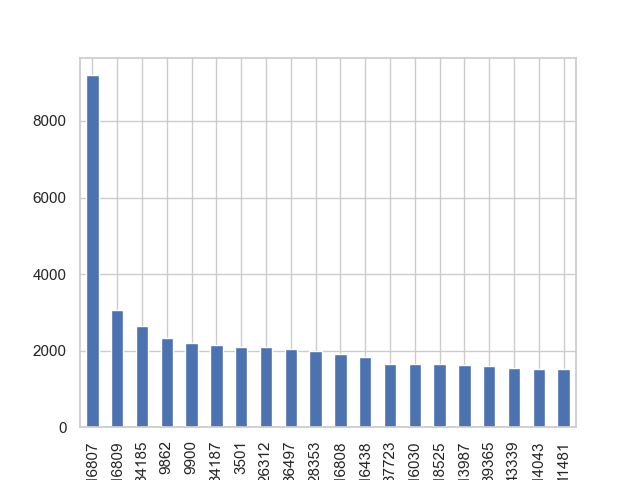

# Descripción del Proyecto

Este proyecto consiste en actuar como consultores para un ecommerce del sector cosméticos, con el objetivo de analizar datos transaccionales para identificar acciones de optimización de la tasa de conversión (CRO). Buscamos incrementar visitas, conversiones, ticket medio, y, en última instancia, aumentar la facturación global.

Para ver el análisis completo consultar los notebooks en python. 

## Objetivos y KPI's

- **Objetivo Principal:** Crear una segmentación RFM y un sistema de recomendación avanzado para impulsar visitas, conversiones, y ticket medio.
- **KPIs Clave:**
  - Visitas
  - Conversión
  - Frecuencia de compra
  - Ticket medio
  - Tasa de abandono de carrito
  - LTV (Lifetime Value)

## Entidades y Datos Analizados

- **Usuarios:** Logados y no logados (cookies temporales). No se conoce el estado de logueo de los usuarios debido a normativas de privacidad.
- **Clientes:** Usuarios con al menos un evento de compra.
- **Sesiones:** Interacciones de los usuarios con el sitio web.
- **Eventos:** Interacciones clave, como mirar producto, añadir al carrito, eliminar del carrito, y compra.
- **Productos:** Información relevante sobre los productos transaccionados.

## Análisis e Insights
 
### Análisis del customer Journey: Situación inicial 

Conclusiones:

Las tasas de partida son un 60% de carrito sobre visualiazaciones y un 22% de compra sobre carrito

Por tanto existe un 40% de visitas sobre las que hay que trabajar para conseguir más carritos, y un 78% de carritos sobre los que trabajar para conseguir más compras

#### Customer Journey por sesion 

En cada sesión, de media:

- Se ven 2.16 productos
- Se añaden 1.3 productos al carrito
- Se eliminan 0.92 productos del carrito
- Se compran 0.29 productos

#### Análisis de los eventos por horas

**Insight #1**: todas las métricas se maximzan en las franjas entre las 9 y las 13 y entre las 18 y las 20

Esta información es muy relevante por ejemplo de cara a paid ads, tanto de generación de tráfico como de retargeting

Además, parece haber algún subtipo de usuario que compra a la 1 de la mañana, que aunque no sea muy frecuente sí compra mucho

#### Media de facturación mensual 

- La media de facturación mensual es de 124.309,92.
- Productos únicos: 45.327

#### Tendencia de los eventos en los últimos meses 

El análisis de las tendencias de compra revela varios patrones interesantes:

- **Black Friday**: El mayor pico de ventas coincide con el Black Friday (29 de noviembre), con un aumento significativo unos días antes, el 22 de noviembre, probablemente debido al inicio de la semana de Black Friday.
- **Navidad**: Las ventas durante los días de Navidad presentan una tendencia decreciente, lo que indica que los consumidores anticipan sus compras navideñas.
- **Reyes y San Valentín**: No se observan picos de ventas durante la semana de Reyes ni en los días previos a San Valentín. Sin embargo, hay un notable aumento de ventas el 27 de enero, posiblemente relacionado con un evento local.

**Insight #2**: La mayoría de las compras navideñas se concentran en la semana del Black Friday.

### Análisis de los clientes 

#### Distribucion en cuanto al gasto 

La gran mayoría de los clientes han gastado menos de 50€ en el período.

#### Distribucion en cuanto al número de compras

**INSIGHT #3** La gran mayoría de los clientes sólo hace una compra.

Hay que tener en cuenta que el periodo analizado es de 5 meses y al tratarse de un eccomerce de productos de cosméticos sería necesario analizar un periodo de tiempo superior.

Existe gran recorrido para mejorar este ratio mediante:

- Email marketing con newletters y ofertas personalizadas

#### Productos por cliente de media en cada compra

**INSIGHT #4** La compra mediana incluye 5 productos.

Pero un 25% de los clientes compran más de 10 productos en la misma compra.

Existe gran recorrido para mejorar este ratio mediante: sistemas de recomendación en el momento de la compra

#### Clientes que generan más ingresos

**INSIGHT #5** Existen clientes con gasto medio decenas de veces superior a la media.Estos clientes compran más de 100 productos por lo que parecen profesionales.

Hay que fidelizar estos clientes mediante programas de fidelización.

### Análisis de supervivencia o de cohortes 

El gráfico de cohortes es una herramienta visual que permite analizar el comportamiento de los clientes a lo largo del tiempo, segmentándolos en grupos (cohortes) según la fecha de su primera compra. 
Dado que solo tenemos 5 meses de histórico vamos a crear análisis de cohortes a 3 meses vista, lo cual nos da para hacer 3 cohortes.

**Grafico de Cohortes**

**INSIGHT #6:** El 90% de que los nuevos clientes no vuelve a comprar en los meses posteriores

### LTV (Life Time Value) de los clientes 

Teniendo en cuenta el 90% de que los nuevos clientes no vuelve a comprar en los meses posteriores podemos calcular el LTV con el histórico que tenemos sin miedo a equivocarnos mucho.

**INSIGHT #7:** El LTV medio es de 42€.

Aplicando nuestro margen sobre esa cifra y el % que queremos dedicar a captación nos sale el importe máximo a invertir en CPA.

Aplicar las acciones de CRO permitirá incrementar el LTV y por tanto también el CPA, siendo una ventaja estratégica muy importante.

### Análisis de los productos 

- Identificación de productos más vendidos. Posiblemente destacando estos productos en la tienda se podrían incrementar las ventas

- **INSIGHT #8**: Casi la mitad de los productos no han tenido ninguna venta en los 5 meses del histórico.

  Se podría realizar un análisis sobre estos productos: ¿No se ven?, ¿Se ven pero no se compran?, ¿Son más baratos en la competencia?

#### Relación entre el precio y el volumen de ventas

  Grafico correlacion precio-compras
  
- Existe una relación clara decreciente
  
#### Productos que se eliminan del carrito

  - Identificación de los productos que más se eliminan del carrito

#### Productos más vistos

  - Destaca sobre todo un producto por encima del resto.
  - Posiblemente lograríamos incrementar las ventas y el ticket medio simplemente destacando estos productos en la tienda.
  - 8 de los productos más vistos estan entre los más comprados. Acciones sobre el resto de productos muy vistos y no comprados para aumentar sus ventas

#### Productos vistos pero no comprados

Hay una oportunidad con estos productos, porque por algún motivo generan el interés de los clientes, pero finalmente no los compran.

## Sistema de Recomendación Basado en Filtrado Colaborativo por Ítems

En este proyecto se desarrolla un **sistema de recomendación** para mejorar la experiencia del usuario en un ecommerce, con el objetivo de incrementar las ventas. Utilizamos un enfoque de **filtrado colaborativo basado en ítems**, que recomienda productos similares a los que un usuario ha visto o comprado anteriormente, analizando patrones de comportamiento entre productos que suelen consumirse juntos.

### Algoritmo de Recomendación
El sistema parte de una **matriz usuario-producto**, que registra cuántas veces cada usuario ha comprado un producto. A partir de esta matriz, se construye una **matriz producto-producto (item-item)**, donde se calculan las distancias entre cada par de productos utilizando la **distancia euclídea**. Esto permite identificar qué productos son más similares entre sí basándose en el comportamiento de compra de los usuarios.

### Generación de Recomendaciones
El sistema recomienda productos no solo basándose en un único ítem, sino en varios productos que el usuario haya interactuado (visto o añadido al carrito). A partir de los productos seleccionados, el algoritmo:

1. Extrae los vectores correspondientes de la matriz item-item.
2. Calcula la **suma de distancias** entre los productos de entrada y todos los demás productos en la matriz.
3. Excluye los productos ya seleccionados para evitar autorecomendaciones.
4. Devuelve los **10 productos con menor distancia**, es decir, aquellos que son más similares a los seleccionados.

### Proceso
Este enfoque flexible permite personalizar las recomendaciones según el historial del usuario, adaptándose a diferentes situaciones y necesidades de la tienda online. Así, el sistema puede generar recomendaciones relevantes basadas tanto en la interacción más reciente del usuario como en su comportamiento acumulado durante la sesión.

### Objetivo
El sistema está diseñado para ofrecer recomendaciones personalizadas y dinámicas, mejorando la experiencia de compra y fomentando la venta cruzada de productos en el ecommerce.

